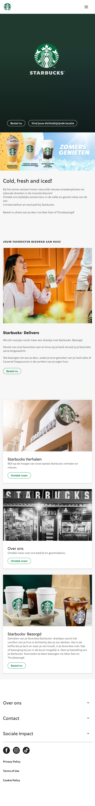
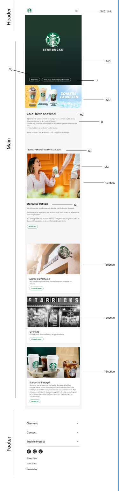
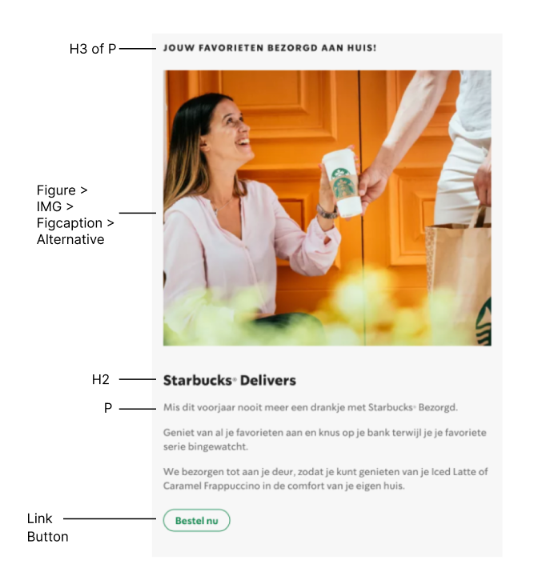
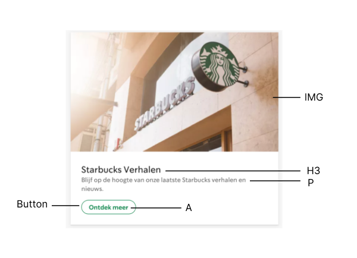

# Procesverslag
Markdown is een simpele manier om HTML te schrijven.  
Markdown cheat cheet: [Hulp bij het schrijven van Markdown](https://github.com/adam-p/markdown-here/wiki/Markdown-Cheatsheet).

Nb. Door *open* toe te voegen aan een *details* element kun je deze standaard open zetten. Fijn om dat steeds voor de relevante stuk(ken) te doen.

## Jij

  
uitwerken voor kick-off werkgroep

  ### Auteur:
  Jesse van Hooff

  #### Blauw

  #### Je focus:
  Surface Plane
 

## Je website

  
uitwerken voor kick-off werkgroep

  ### Je opdracht:
  starbucks.nl

  #### Screenshot(s) van de eerste pagina (small screen): 
  hier de naam van de pagina  
  

  #### Screenshot(s) van de tweede pagina (small screen):
  hier de naam van de pagina  
  
 

## Toegankelijkheidstest 1/2 (week 1)

  
uitwerken na test in 1e werkgroep

### Bevindingen
  Lijst met je bevindingen die in de test naar voren kwamen:

  #### Screenreader
Omdat er ontzettend veel gebruik wordt gemaakt van divjes en er weinig alt-text aanwezig is, kan je er bijna niet uitkomen waar je bent op de pagina. Ook zouden titels/links beter moeten worden verteld i.p.v bepaalde codenamen te horen. Dit maakt het duidelijker voor de gebruiker. 	

#### Muis en Toetsenbord 
  Het navigeren met de tab-toets gaat redelijk goed, wel worden knoppen overgeslagen. Ook geeft hij niet aan bij welke sectie welke knop hoort. Zo word je ineens doorverwezen naar een compleet ander onderdeel van de website waar ook een "bestel nu" knop zit. Het is dus heel onduidelijk. 
  
  Door de code beter en hierarchisch duidelijker te schrijven, en rekening te houden met de navigatie patronen binnen de pagina zou het opgelost kunnen worden. 

#### Motoriek (shocks, elastiekjes)
Omdat de website kleinere buttons hanteert zou de focus daar op kunnen liggen, deze zijn namelijk slecht klikbaar voor mensen met spasme of andere zenuw aandoeningen. Door de buttons te vergroten kan ik de website beter toegankelijk maken, zonder per sé de huisstijl te doorbreken. Ik wil dit dan ook graag doorvoeren, al is het alleen maar om te testen of het dan ook echt beter werkt. 

#### Visueel (brillen, contrast, kleurenblind, dark/light). 
  
Hemianopia - Dit heeft geen tot weinig effect op de website. Doordat de informatie die wordt getoond op meerdere plekken wordt herhaald is er geen gemis aan informatie. 
Glaucoma - De ietwat kleine knoppen kunnen ervoor zorgen dat mensen met glaucoma het contrast iets minder goed zien. Dit komt ook door de dunne lijnen van knoppen, ik wil proberen om dit te verhelpen, in combinatie met de motorieke stoornis oplossing die ik hierboven beschrijf. 
Low Contrast - Dit staat in verband met de aandoening die ik hierboven beschrijf, aan het contrast kan nog het een en ander worden gedaan. Belangrijk punt hierbij zijn o.a de dunne lijntjes van knoppen en de kleine/dunne tekstjes.
Diabetic Eye Disease - Alhoewel het zeer hinderlijk is, blijft de website bruikbaar voor mensen met deze aandoening. Het contrast verhogen kan wel helpen. 
Cataract - De website is slecht te zien, het kan helpen om VoiceOver te gebruiken om duidelijk te hebben waar je op dat moment bent. 
Central Field Loss - Voornamelijk het Logo (de Hero image) en de afbeeldingen worden slechter zichtbaar. Het kan helpen om de tekst bondiger op te schrijven zodat gebruikers geen lange lappen tekst met gaten hoeven te lezen. 

## Breakdownschets (week 1)

  
uitwerken na afloop 2e werkgroep

  ### de hele pagina: 
  

  ### dynamisch deel (bijv menu): 
  

  ### wellicht nog een dynamisch deel (bijv filter): 
  

## Voortgang 1 (week 2)

  
uitwerken voor 1e voortgang

  ### Stand van zaken
  Ik merkte dat ik nog wat moeite had met het benoemen van HTML tags. Ik heb daarom veel moeten Googlen en inspecten. Daarna ben ik begonnen met het tikken van de content en het verzamelen van al het beeldmateriaal. 

  ### Agenda voor meeting
  samen met je groepje opstellen

  | student 1      | student 2          | student 3    | student 4        |
  |                |                    |              |                  |
  | Breakdownschets Breakdownschets     Breakdownschets  Breakdownschets
   + Code           + Code              + Code          + Code

  ### Verslag van meeting
  hier na afloop snel de uitkomsten van de meeting vastleggen

  - punt 1
  - punt 2
  - nog een punt
  - ...

## Voortgang 2 (week 3)

  
uitwerken voor 2e voortgang

  ### Stand van zaken
  Ik ben begonnen met het schrijven van de eerste CSS code. Ik merkte dat ik wederom veel terugviel op het internet, en dan met name de Flexbox uitleg van Chris Coyer. Het gaf mij rust om te weten dat ik steeds weer de stappen kon volgen. Ik ben nu bezig met het maken van de nav bar en het stylen van de navigatie knoppen. Ook ben ik bezig met het Javascript onderdeel in het menu. 

  ### Agenda voor meeting
  samen met je groepje opstellen

  | Jesse          | Emilio              | Giorgio        | Nathan           |
  | ---            | ---               | ---              | ---              |
  | CSS Bespreken  | CSS + Breakpoints | CSS Bespreken    | Geen Reactie     |
  | Javascript     | dit als er tijd is|                  | dit wil ik zeker |
  | ...            | ...               | ...              | ...              |

  ### Verslag van meeting
  hier na afloop snel de uitkomsten van de meeting vastleggen

  - punt 1
  - punt 2
  - nog een punt
- ...

## Toegankelijkheidstest 2/2 (week 4)

  
uitwerken na test in 8e werkgroep

  ### Bevindingen
  Lijst met je bevindingen die in de test naar voren kwamen (geef ook aan wat er verbeterd is):

  #### Screenreader
  Hier korte omschrijving (met indien nodig afbeeldingen)

  Hier een omschrijving van hoe het opgelost kan worden (met indien nodig afbeeldingen)

  #### Muis en Toetsenbord 
   In dit onderdeel heb ik getest hoe navigeerbaar mijn website is met enkel het toetsenbord 

   Het tabben gaat goed, ik kan alleen het menu niet in. Na het vragen aan Sanne blijkt dat dat mogelijk is om menu's automatisch uit elkaar te laten schuiven. Dat blijkt echter een behoorlijke klus, dus dat laat ik voor nu even achterwege. 

  #### Motoriek (shocks, elastiekjes)
  Voor dit onderdeel heb ik het schock apparaat omgedaan en heb ik met de elastiekjes getest!

  Ik heb het apparaat met de electische schokjes uitgeprobeerd. De website was nog goed te gebruiken met het apparaat op de laagste stand. Toen Sanne echter het apparaat op de hoogste stand zette was het praktisch onmogelijk om kleinere buttons aan te klikken. Ook het lezen van tekst werd lastiger omdat ik meer energie kwijt was aan het aanspannen van spieren dan aan het letten op de tekst.  

  De elastiekjes waren veel minder intensief. Het voelde meer aan als een verdikte vinger die ik net had gestoten dan dat ik echt gehinderd werd. Ik kon alles aanklikken, al werd het wel minder goed klikbaar naarmate de buttons steeds kleiner werden. 

  #### Visueel (brillen, contrast, kleurenblind, dark/light). 
  Met deze brillen heb ik getest hoe mijn website zichtbaar is met verschillende brillen op. (met indien nodig afbeeldingen)

Blur/Glare: Met deze bril kan ik de titels op de landings niet lezen. Ook de zwarte tekst op de webpagina kan ik niet lezen. Idem dito met de zwarte titels. De plaatjes kan ik gelukkig wel zin. De buttons kan ik ook niet lezen. De buttons onderaan de footer kan ik wel lezen gelukkig. 

Peripheral Field Loss: Met deze bril is het lastig om te zien wat de afbeeldingen betekenen. Je ziet slecht wat voor vorm er wordt weergegeven. Dit kan opgelost worden met een figcaption waarmee de afbeelding wordt uitgelegd. 

Combined Loss Diabetic Eye Disease: Door de grote vlokken op het scherm is het lastig om te zien wat er zich op het scherm afspeelt. Het zorgt ervoor dat je afgeleid raakt of je hoofd moet bewegen om het vanuit een bepaalde hoek wel te kunnen zien. Ik denk dat ik weinig kan doen om deze ervaring beter te maken.

Stip in het midden bril: De grote stip in het midden maakt het heel lastig om de content te bekijken. Content wat zich wat meer aan de zijkant afspeelt is redelijk goed te doen, maar focussen op tekst in het midden is erg lastig. 

Low Contrast: Het lage contrast zorgt ervoor dat ik de tekst en afbeeldigen slecht kan zien/lezen. 

Central field Loss : Ik kan hiermee slecht lezen wat voor tekst er wordt weergegeven. De afbeeldingen worden ook vaag, maar wanneer je schuin kijkt kan je het wel beter zien. Ik kan een optie bieden in mijn website om het beter toegankelijk te maken. 

Hemifield Loss: 

## Voortgang 3 (week 4)

  
uitwerken voor 3e voortgang

  ### Stand van zaken
  hier dit ging goed & dit was lastig (neem ook screenshots op van delen van je website en code)

  ### Agenda voor meeting
  samen met je groepje opstellen

  | student 1      | student 2          | student 3    | student 4        |
  | ---            | ---                | ---          | ---              |
  | dit bespreken  | en dit             | en ik dit    | en dan ik dat    |
  | en dat ook nog | dit als er tijd is | nog een punt | dit wil ik zeker |
  | ...            | ...                | ...          | ...              |

  ### Verslag van meeting
  hier na afloop snel de uitkomsten van de meeting vastleggen

  - punt 1
  - punt 2
  - nog een punt
  - ...

## Eindgesprek (week 5)

  
uitwerken voor eindgesprek

  ### Je uitkomst - karakteristiek screenshots:
  

  ### Dit ging goed/Heb ik geleerd: 
  Korte omschrijving met plaatjes

  

  ### Dit was lastig/Is niet gelukt:
  Korte omschrijving met plaatjes

  

## Bronnenlijst

  
continu bijhouden terwijl je werkt

  Nb. Wees specifiek ('css-tricks' als bron is bijv. niet specifiek genoeg).

  1. bron 1
  2. bron 2
  3. ...

